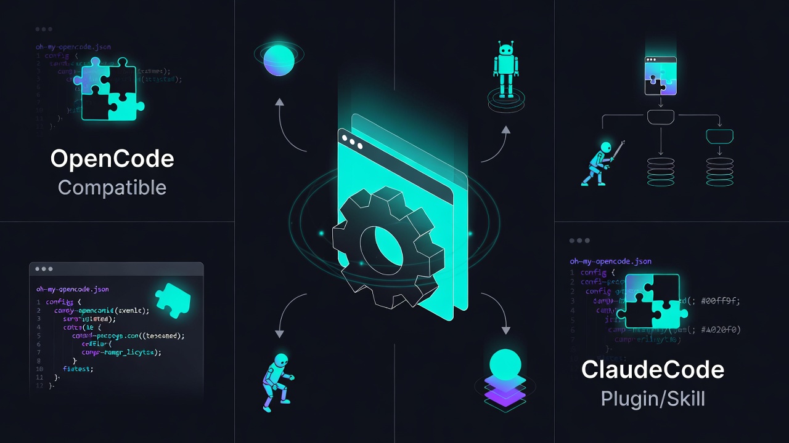

# omo-config-manager

<div align="center">
  
</div>

Cross-platform plugin providing comprehensive OMO configuration management with `/omo-config` command. Works with both OpenCode and Claude Code.

## Features

- ✅ **Cross-Harness** - Works with both OpenCode and Claude Code
- ✅ **Natural Language Interface** - Use `/omo-config` with conversational commands
- ✅ **Read-Write Operations** - Modifies your local OpenCode/OMO config files
- ✅ **Safety Backups** - Creates timestamped backups **before** any write operation (keeps 5 most recent)
- ✅ **Cross-Platform Paths** - Supports Linux/macOS (`XDG_CONFIG_HOME` / `~/.config`) and Windows (`%APPDATA%`)
- ✅ **JSON + JSONC** - Reads `opencode.json` or `opencode.jsonc` (same for `oh-my-opencode`)
- ✅ **Type Safe** - Full TypeScript interfaces for all configuration structures
- ✅ **omo-config Skill** - OMO configuration specialist skill with 30+ actions
- 🆕 **Pricing Verification** - Check current API pricing against your roster documentation
- 🆕 **Model Availability** - Verify configured models exist before deployment
- 🆕 **Concurrency Analysis** - Optimize provider/model selection for parallel tasks
- 🆕 **Smart Recommendations** - Get model suggestions based on task complexity
- 🆕 **Provider Comparison** - Compare same model across google/, opencode/, openrouter/
- 🆕 **Delegation Insights** - Understand how Sisyphus routes tasks through categories

## Installation

### For LLM Agents

Fetch the installation guide and follow it:

```bash
curl -s https://raw.githubusercontent.com/shawnmarck/omo-config-manager/refs/heads/master/docs/guide/installation.md
```

### For Humans

Copy and paste this prompt to your LLM agent (Claude Code, OpenCode, etc.):

```
Install and configure omo-config-manager by following the instructions here:
https://raw.githubusercontent.com/shawnmarck/omo-config-manager/refs/heads/master/docs/guide/installation.md
```

Or read the [Installation Guide](docs/guide/installation.md) directly—but **we strongly recommend letting an agent handle it. Humans make mistakes.**

## Uninstallation

To remove omo-config-manager:

1. **Remove the plugin from your OpenCode config**  
Edit `~/.config/opencode/opencode.json` (or `opencode.jsonc`) and remove the plugin path from the `plugin` array. The path will be either:
- `file:~/.config/opencode/plugin/omo-config-manager` (Linux/macOS)
- `file:%APPDATA%\opencode\plugin\omo-config-manager` (Windows)

```bash
# Using jq (Linux/macOS)
jq '.plugin = [.plugin[] | select(. != "file:~/.config/opencode/plugin/omo-config-manager")]' \
    ~/.config/opencode/opencode.json > /tmp/oc.json && \
    mv /tmp/oc.json ~/.config/opencode/opencode.json
```

2. **Remove the plugin directory (optional)**  
```bash
# Linux/macOS
rm -rf ~/.config/opencode/plugin/omo-config-manager

# Windows
rmdir /s "%APPDATA%\opencode\plugin\omo-config-manager"
```

3. **Verify removal**  
```bash
opencode --version
# Plugin should no longer be loaded
```

## Usage

Use the `/omo-config` command with natural language requests:

```bash
# List information
/omo-config list my agents
/omo-config list categories
/omo-config show permissions
/omo-config list my opencode models

# Configuration management
/omo-config add a new agent called debugger
/omo-config modify oracle agent
/omo-config add a category called data-science
/omo-config disable comment-checker hook

# Backup & restore
/omo-config backup my configs
/omo-config restore from backup
/omo-config compare my current config with last backup
/omo-config fix my backups

# Validation & diagnostics
/omo-config verify pricing
/omo-config check model availability
/omo-config validate my config
/omo-config run diagnostics

# Analysis & optimization
/omo-config show concurrency limits
/omo-config compare providers for gemini-3-flash
/omo-config recommend a model for test writing
/omo-config explain delegation routing
/omo-config optimize concurrency
```

The command uses natural language processing, so you can phrase requests in various ways.

### Example Output

Here's what you'll see when you run `/omo-config show me my agents`:

```
# Your Oh-My-OpenCode Agents

Here's a comprehensive list of all your configured custom agents:
| Agent Name | Default Model | Purpose |
|------------|---------------|---------|
| **oracle** | `opencode/gpt-5.2` | Premium reasoning agent for complex architecture decisions and deep debugging |
| **librarian** | `opencode/kimi-k2.5` | Research specialist for documentation lookup and multi-repo analysis |
| **explore** | `opencode/claude-sonnet-4-5` | Code search specialist for fast codebase exploration |
| **metis** | `opencode/claude-sonnet-4-5` | Pre-planning analyst to identify ambiguities before planning |
| **prometheus** | `opencode/claude-sonnet-4-5` | Strategic planner for creating clear, actionable plans |
| **momus** | `opencode/claude-sonnet-4-5` | Plan validator to check for clarity, completeness, and feasibility |
| **atlas** | `opencode/claude-sonnet-4-5` | General purpose agent for various tasks |

**Default Categories:**
| Category Name | Default Model | Purpose |
|---------------|---------------|---------|
| **quick** | `opencode/claude-sonnet-4-5` | Fast responses for simple tasks |
| **general** | `opencode/claude-sonnet-4-5` | Balanced performance for everyday coding tasks |
| **ultrabrain** | `opencode/gpt-5.2` | Maximum reasoning power for complex problems |

*Note: Default models may vary based on your OpenCode provider configuration. Use `/omo-config list my agents` to see your actual configuration.*

### Supported Actions

| Category | Actions |
|----------|---------|
| **List** | agents, categories, skills, opencode models, models by provider, concurrency limits |
| **Manage** | add/modify agents, add/modify categories, enable/disable hooks |
| **Backup** | backup configs, restore from backup, compare backups, fix backup naming |
| **Validation** | verify pricing, check model availability, validate config, run diagnostics |
| **Analysis** | compare providers, recommend model, explain delegation, optimize concurrency |
| **Permissions** | show global and agent-specific permissions |
```

## How It Works

1. **Natural Language Parsing** - Interprets requests using word-boundary matching
2. **Action Execution** - Executes with full read-write support
3. **Safety First** - Creates automatic backups before write operations
4. **Error Handling** - Specific error messages for different failure scenarios

### Security & Implementation Notes

- **Limited network calls**: The `verify pricing` action uses WebSearch to check current API pricing (2026). The `check model availability` action uses the `opencode models` CLI command (local, no network). All other operations are local file operations.
- **Prompt fields are redacted** in "added/modified" summaries to avoid accidentally echoing sensitive prompt text.
- **Validation & diagnostics are fully implemented**: These actions perform real checks including model availability verification, pricing accuracy checks, backup naming validation, and concurrency analysis.

## License

MIT

## Author

https://shawnmarck.github.io/

## Repository

https://github.com/shawnmarck/omo-config-manager
